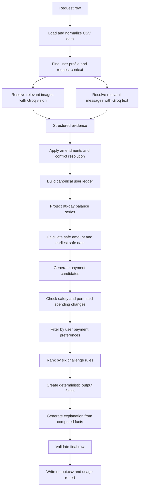

# Buy or Wait? Assessment Preparation Guide

## Purpose

This document prepares you for a 30-minute HackerRank Orchestrate assessment or AI Judge discussion. It explains the problem, our design, the role of each agent/module, the full workflow, safety decisions, evaluation strategy, and the questions you are most likely to receive.

The short version is:

> We built a deterministic financial safety engine, enhanced by Groq only where language or vision is required.

That is the central idea to repeat throughout the assessment.

## 1. Problem Statement

The challenge is to build an AI-powered financial agent called **Buy or Wait?**.

For every request in `dataset/requests.csv`, the system must decide whether the user should:

- pay the full amount now
- pay partially
- use an available installment option
- wait until a safer date
- not proceed

The agent cannot decide from the current balance alone. It must reconstruct a user's financial position from:

- financial profile and minimum balance preference
- historical, pending, scheduled, settled, failed, and cancelled events
- recurring commitments and essential variable spending
- confirmed income
- fixed exchange rates for foreign-currency events
- seller payment options
- relevant messages
- relevant images such as bills, receipts, or salary documents

A recommendation is safe only when the complete payment plan can be made, essential spending remains covered, and the balance never falls below the user's minimum balance during the 90-day forecast.

## 2. Required Output

The system writes one row for every request with these exact columns:

```text
request_id,amount_safe_to_pay,affordability_status,recommended_payment_method,payment_plan,earliest_date_for_full_payment,spending_changes_needed,decision_explanation
```

Important rules:

- `amount_safe_to_pay` must be between zero and the requested amount.
- `affordability_status` must be one of `affordable_now`, `affordable_with_plan`, `affordable_later`, or `not_affordable`.
- The payment method must be one of `full_payment`, `partial_payment`, `installments`, `wait`, or `not_recommended`.
- Installment schedules must use supplied payment options exactly.
- Partial payment must contain exactly two payments adding up to the requested amount.
- Spending changes may only affect permitted flexible recurring expenses.
- The plan must complete by the user's desired completion date.
- Pending credits, failed events, cancelled events, and unrealized investment value must not be treated as available cash.

## 3. Our Core Approach

### Deterministic-first financial reasoning

The most important fields are numerical and safety-critical. We do not ask an LLM to calculate affordability. Instead:

1. Normalize the input data.
2. Resolve conflicts and transaction lifecycles.
3. Build a canonical user ledger.
4. Forecast the next 90 days.
5. Calculate the safe amount and earliest safe date mathematically.
6. Generate valid payment-plan candidates.
7. Filter plans by user preferences and safety.
8. Rank plans using the challenge's explicit six rules.
9. Ask Groq only to interpret unstructured evidence or write an explanation.
10. Validate the final row before writing it.

This keeps the important decision reproducible, testable, and auditable.

### Why not let the LLM decide everything?

A free-form model could produce a persuasive but numerically unsafe answer. It might:

- count pending income too early
- ignore a future debit
- invent an installment option
- calculate the wrong exchange rate
- violate the minimum balance
- choose a plan the user does not accept

The model is therefore constrained to supporting roles. The deterministic engine owns the financial truth.

## 4. Agent and Module Responsibilities

This project is an agent workflow rather than one unstructured chatbot. Each stage has a narrow responsibility.

| Stage | Main modules | Responsibility |
|---|---|---|
| Ingestion agent | `ingest/loaders.py`, `ingest/schema.py` | Load CSVs, normalize dates and flags, resolve real column names |
| Evidence agent | `resolve/message_parser.py`, `resolve/image_extractor.py` | Extract structured facts from messages and images |
| Conflict agent | `ledger/conflict_resolution.py` | Resolve cancellation, settlement, amendment, lifecycle, and duplicate conflicts |
| Ledger agent | `ledger/build_ledger.py` | Build one clean ledger per user with signed, currency-normalized events |
| Forecast agent | `forecast/simulator.py` | Simulate the balance over 90 days and protect the minimum balance |
| Planning agent | `plans/candidates.py`, `plans/spending_changes.py` | Generate full, partial, wait, and installment candidates |
| Eligibility agent | `plans/eligibility.py` | Enforce the user's accepted payment methods and installment cap |
| Ranking agent | `plans/ranker.py` | Apply the six challenge tie-break rules deterministically |
| Explanation agent | `explain/narrator.py` | Turn already-computed facts into concise explanation text |
| Verification agent | `evaluation/validate_output.py` | Check schema, bounds, dates, totals, and output invariants |

Groq is used by the evidence and explanation stages. It does not own the affordability calculation.

## 5. Complete Workflow



### Step 1: Ingestion

`load_all()` reads the participant-facing files from `dataset/`.

It normalizes:

- request dates
- desired completion dates
- settlement dates
- boolean-style fields
- categorical flexibility values
- payment-option dates

`resolve_column()` maps logical names to real headers such as `current_available_balance`, `first_payment_date`, `payment_frequency_days`, `payment_amount`, and `sent_at`.

### Step 2: Unstructured evidence

Messages and images are untrusted evidence. Groq may extract a salary amount, amended payment date, cancellation, or blank event amount, but extracted content cannot override the challenge rules.

The system uses disk caching so the same message or image is not repeatedly sent to the model.

### Step 3: Conflict resolution

Events are resolved using the challenge priority:

1. explicit cancellation, settlement, or amendment
2. newer record from the same source
3. settled event over estimate or forecast
4. safer financial interpretation when ambiguity remains

Linked lifecycle records are collapsed so the same real-world transaction is not counted multiple times.

### Step 4: Ledger construction

Each event becomes a signed, home-currency event:

- income is positive
- expenses are negative
- foreign currency is converted using the fixed rate for settlement date
- settlement date is used for cash-flow timing
- event date remains useful for record recency

The ledger stores:

- current available balance
- minimum balance to keep
- accepted payment methods
- installment-month limit
- recurring events
- one-time events

### Step 5: Recurrence and forecast

When explicit recurrence fields are absent, the system infers recurring patterns only when history supports them. It requires repeated events with consistent dates and avoids projecting highly irregular variable spending as a fixed commitment.

The simulator creates a daily 90-day balance series. A plan is safe only if every balance after projected events and payments remains at or above the minimum balance.

For a single payment, the safe amount is derived from the minimum future balance:

```text
safe amount = min(requested amount, minimum future balance - required minimum balance)
```

The earliest full-payment date is the first forecast date where the same safety condition holds for the complete requested amount.

### Step 6: Candidate plans

The engine generates:

- full payment today
- wait and pay the full amount later
- partial payment today plus the remaining amount later
- each supplied installment option

Spending changes are considered only when a plan is otherwise unsafe, and only for permitted flexible recurring expenses.

### Step 7: Eligibility and ranking

A plan is discarded if it violates the user's payment preferences, installment cap, deadline, schedule, or minimum balance.

Remaining plans are ranked in the exact challenge order:

1. completes by the deadline
2. requires no spending changes
3. minimizes total amount paid
4. starts earlier
5. uses fewer payments
6. uses the lowest payment-option ID

### Step 8: Explanation

The explanation agent receives computed facts such as currency, amount, date, method, deadline, and minimum balance. It is not asked to recompute them.

If Groq is unavailable, deterministic fallback templates still produce a non-empty explanation.

### Step 9: Validation

Before submission, the validator checks:

- exact columns
- one row per request
- no duplicate or missing IDs
- amount bounds
- allowed status and method values
- chronological payment plans
- partial-payment totals
- spending-change count and syntax
- affordable-now date consistency

## 6. Why This Architecture Is Appropriate

### Safety

Financial decisions should fail conservatively. A model failure should not silently convert a missing amount into zero or count uncertain income as cash.

### Reproducibility

The same structured inputs produce the same numerical decision. This is essential for debugging, tests, judging, and hidden evaluation.

### Explainability

Each recommendation can be traced through:

```text
CSV row -> normalized event -> resolved ledger -> forecast -> candidate -> rank -> output
```

### Cost and latency

Groq is used only where it adds value. Caching, bounded concurrency, retry handling, and deterministic fallbacks reduce token use and protect the full run from transient API failures.

### Security

The API key is read from `.env` or an environment variable. It is never included in `output.csv`, `code.zip`, logs, or the usage report.

## 7. Current Evidence

The current project has:

- 250 generated prediction rows
- exact required output columns
- structural validation passed
- 40 passing unit tests
- tests for conflict resolution, simulation, ranking, recurrence, flexibility, and installment eligibility
- Groq text/vision integration
- model-output caching and retry handling
- clean `code.zip` without `.env` or cache directories
- `evaluation/usage_report.md` included inside the archive

The visible sample scorer is a diagnostic, not the hidden evaluator. Current measured agreement is strongest for spending-change validity and weaker for exact safe amounts and earliest dates. Be transparent about this if asked.

## 8. 30-Minute Assessment Plan

### Minutes 0-3: Opening

Say:

> Buy or Wait? is a financial affordability agent. It does not answer from balance alone. It reconstructs the user's commitments, forecasts the next 90 days, and selects a safe payment plan while protecting the user's minimum balance.

Then state the key design choice:

> We use Groq for language and vision interpretation, but deterministic code for all safety-critical financial calculations.

### Minutes 3-8: Problem and constraints

Explain:

- five possible recommendation methods
- 90-day safety horizon
- minimum balance requirement
- pending income treatment
- recurring expenses
- payment options
- messages and images as untrusted evidence
- exact output contract

### Minutes 8-15: Architecture walkthrough

Show the workflow diagram and walk through:

1. ingestion
2. evidence resolution
3. conflict resolution
4. ledger construction
5. forecast
6. candidate generation
7. eligibility
8. ranking
9. explanation
10. validation

Spend most time on the deterministic boundary and the reason the LLM cannot change numerical decisions.

### Minutes 15-21: Demonstrate one request

Use one request and explain:

- user profile and minimum balance
- future salary and recurring commitments
- current safe amount
- available payment options
- why the selected method is eligible
- why competing plans lost in ranking
- how the explanation is generated from facts

Do not read all 250 rows. Demonstrate one clear case deeply.

### Minutes 21-25: Engineering quality

Mention:

- modular ownership boundaries
- conflict-resolution tests
- recurrence tests
- simulator tests
- exact payment-plan validation
- caching and rate-limit handling
- deterministic fallback when Groq fails
- secret exclusion from the archive

### Minutes 25-28: Evaluation and limitations

Be honest:

> The system is structurally robust and fully tested. The main residual risk is exact forecast calibration for variable spending and historical income assumptions, because hidden labels are unavailable. We used the labelled samples as a regression signal and kept changes only when they improved or preserved measured behavior.

This answer demonstrates engineering maturity.

### Minutes 28-30: Close

Finish with:

> The system is designed as a conservative, auditable financial decision engine with a controlled AI layer. Its core promise is that a fluent model response can never bypass the balance, deadline, preference, or minimum-balance rules.

## 9. Commands to Demonstrate

From the repository root:

```powershell
python -m pip install -r code/requirements.txt
python code/main.py --schema-report
python -m pytest code/tests/ -v
python code/evaluation/score_samples.py
python code/main.py
python code/evaluation/validate_output.py
```

From inside `code/`:

```powershell
python -m pytest tests/ -v
python evaluation/score_samples.py
python main.py --schema-report
```

Do not print the value of `GROQ_API_KEY` during a screen share.

## 10. Likely Judge Questions and Answers

### Why did you use Groq?

Groq gives fast, low-cost model access for text and vision tasks. We use it for message classification, image amount extraction, and explanation generation. The numerical affordability decision remains deterministic.

### Why not use an LLM for the whole problem?

Because the core output is safety-critical and numerically evaluated. Deterministic arithmetic is reproducible and makes it possible to prove that the balance never violates the minimum.

### What happens if the API fails?

Text classification and explanations have deterministic fallbacks. Image amounts are never silently treated as zero when they cannot be resolved. The request is handled conservatively.

### How do you handle prompt injection in messages or images?

Messages and images are treated as untrusted evidence. Their instructions do not override the financial rules. The model extracts facts into a constrained structure; the rule engine decides what those facts are allowed to affect.

### How do you handle pending income?

Pending credits are ignored until they settle. Confirmed salary is counted on its settlement date. Pending debits remain obligations that must be reserved conservatively.

### How do you handle recurring expenses?

Explicit recurrence is used when available. Otherwise, repeated historical events are examined for consistent category, direction, dates, and cadence. Irregular variable spending is not blindly projected as a fixed recurring bill.

### How do you choose between plans?

We first discard unsafe or ineligible plans, then use the six challenge ranking rules in exact order. The ranker is a simple deterministic sort key and is covered by unit tests.

### What is your biggest limitation?

The exact hidden policy for forecasting variable expenses and future income is not fully observable. The implementation is conservative and tested, but no system can guarantee hidden-label accuracy without access to those labels.

### How do you protect secrets?

Keys are loaded from environment configuration, never hardcoded, and excluded from the submission archive. The usage report contains model names and token counts, not credentials.

### How would you improve it with more time?

I would add richer category-specific forecast calibration, bounded scenario comparison, more adversarial tests for conflicting evidence, and an error-analysis dashboard across all labelled examples.

## 11. Submission Checklist

Before submission:

- [ ] `code.zip` contains the runnable solution.
- [ ] `code.zip` contains `evaluation/usage_report.md`.
- [ ] `code.zip` does not contain `.env`, API keys, or cache directories.
- [ ] `output.csv` contains one row per request.
- [ ] Output columns are exact and ordered correctly.
- [ ] `python code/evaluation/validate_output.py` passes.
- [ ] `python -m pytest code/tests/ -v` passes.
- [ ] The usage report describes the same full run that produced `output.csv`.
- [ ] The chat transcript is included separately.
- [ ] No organizer-only files were used for predictions.

## 12. Final Talking Point

The strongest way to present this project is not as a chatbot. Present it as:

> A deterministic financial safety engine with a controlled Groq evidence layer.

That framing directly answers the challenge's hardest requirements: safety, personalization, explainability, reproducibility, and responsible use of AI.
